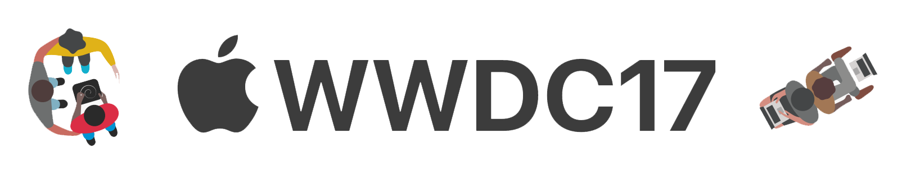
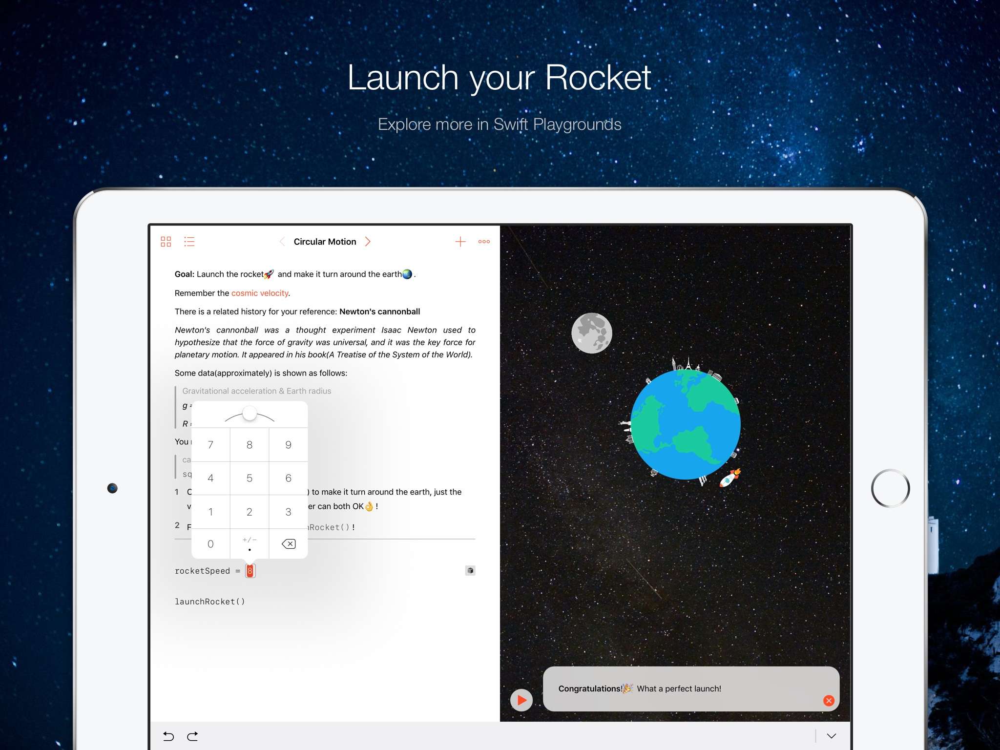
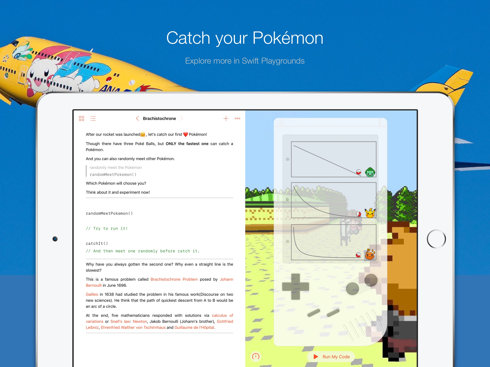

# WWDC17Apply

   

[a Swift Playgrounds Project applying for WWDC17](https://github.com/zjzsliyang/WWDC17Apply)

------

[WWDC Scholarships](https://developer.apple.com/wwdc/scholarships/)

- Submissions will be accepted from Monday, March 27, 2017 at 10:00 a.m. PDT until Sunday, April 2, 2017 at 5:00 p.m. PDT. 
- All applicants will be notified of their status by Friday, April 21, 2017.

## Applying

- Tell us about yourself.
- Provide school / membership information.
- Upload your Swift playground.
  - Create a visually interactive scene in a Swift playground that can be experienced within three minutes. Be creative. You can use [Swift Playgrounds](https://itunes.apple.com/us/app/swift-playgrounds/id908519492?mt=8) on iPad or [Xcode](https://itunes.apple.com/us/app/xcode/id497799835?ls=1&mt=12) on macOS. If you need inspiration, start with templates in Swift Playgrounds for a head start on more advanced creations. Get inventive and make them your own by adding graphics, audio, and more.
- Describe your Swift playground.
- Provide optional information.

## Judging

- Technical accomplishment
- Creativity of ideas
- Content of written responses

## Reference

[Playground Book](https://developer.apple.com/library/prerelease/content/documentation/Xcode/Conceptual/swift_playgrounds_doc_format/index.html#//apple_ref/doc/uid/TP40017343-CH47-SW4)

[WWDC Video](https://developer.apple.com/videos/play/wwdc2016/408/)

## Project

- Chapters 
  - Mechanics.playgroundchapter
    - Pages
      - [x] Brachistochrone
      - [x] CircularMotion
      - [ ] Freefall
      - [ ] Pendulum
      - [ ] ElasticCollision

## Description

> Tell us about the features and technologies you used in your Swift playground.

### Technologies

Gesture Recognizer, UIDynamics, Core Animation, Core Graphics, AVFoundation, Core Location, PlaygroundSupport.

### Features

This Playground Book is to help students learn Mechanics easily and intuitively with vivid animation and function calls, including a circular motion page and a brachistochrone page, which have pretty difficult knowledge for primary school students or even a  high school students.

In the Circular Motion Page, users will learn Newton's law of universal gravitation and circular motion formula to calculate the second cosmic velocity. I have using many technologies such as Gesture Recognizer, UIDynamics to create an animation that the earth and moon. In Hints, User will learn the formula step by step and terminology like cosmic velocity are showed in the LiveView and Glossary, they can know the physical things easily without getting confused. To make it work fine, I have to dive deep into RunLoop things to fix bugs since there has little materials about Playground Book tutorial on the Internet. When users calculate the current value, it will launch a rocket and play a music to motivate user via AVFoundation. However, when the value is incorrect, he will get a hint to think again. I also use MVC pattern to separate playground's concerns to have high cohesion and low coupling. Core Location framework is used to get the user's current city asynchronously, but it might have little problems in the delegate.

In Brachistochrone Page, users will learn brachistochrone, which means that from one point to another, the fastest path is not a straight line. I also use UIDynamics to simulate the gravity behavior and collision. Through the perspective of a story(catch your Pokemon), users will realize this common but intriguing phenomenon. Users can call the random function to meet different Pokemon, so the child won't get boring. This page also has a lot physical history associated with this problem, children can learn many physicists' basic information and their opinions within this happy game. I use classes and functions to encapsulate different objects and method to keep the code clean. Extending class, overriding function, delegate are all used to make it work. I also learn to handle the audio(decrease the volume at the end) and draw the UI to have a better user experience.

## Beyond WWDC(optional)

> In what ways have you considered sharing your coding knowledge and enthusiasm for computer science with others?

- My experience about learning Swift
  - I start programming at university, and as a sophomore student, I learning iOS development since last semester and now I can develop an app by myself. I attended iOS Club Winter and have a great experience in Guangzhou, China. What's more, I applied an intern in Shanghai this summer in Apple, hope can be an Appler!
  - As an iOS developer, I am eager to attend WWDC, one of the biggest feast of developers, I really hope to communicate with other developers, Apple's engineers and have a visit.
- Study in Tongji Apple Club with friends
  - I am a member of Tongji Apple Club, and this is a space that all students loving iOS development can work together to solve the problems and communicate with others. We can lend adapters and other devices, use the second screen… What's the most important is that we have a meeting sharing what we learned weekly, and Junior students will teach us a lot. I think it's a great form for a student club in universities and wishes to share our experience during WWDC.
- My experience with developing this Playground Book
  - One big difference is that I can only create via code and no more storyboard things.
  - There is a little tutorial about Playground Book and have to try by myself once and once again.

## Comments(optional)

> Is there anything else you would like us to know?

## Screenshot

## Disclaimer

[Non-Commercial Use Permitted.](http://www.pokemon.com/us/legal/)

© 2017 Pokémon. © 1995–2017 Nintendo/Creatures Inc./GAME FREAK inc.

Pokémon, Pokémon character names are trademarks of Nintendo.